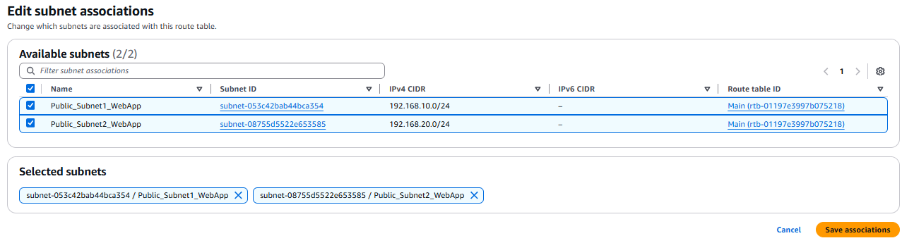
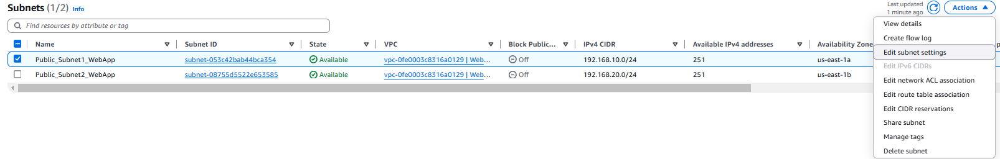
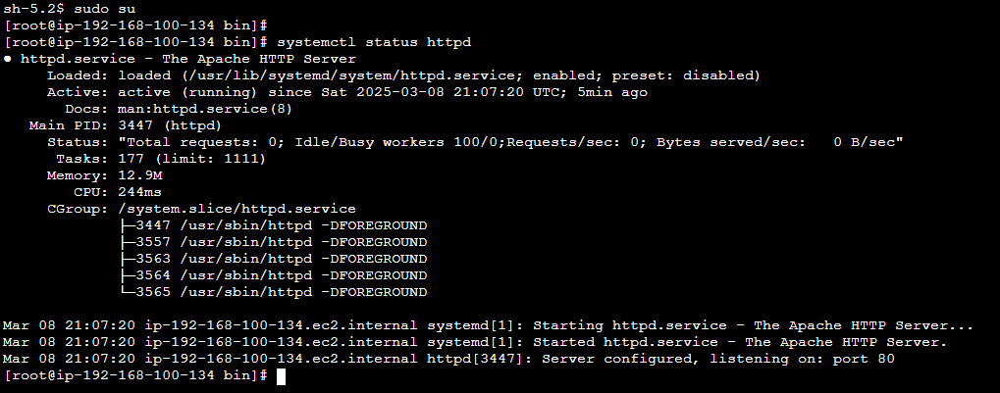
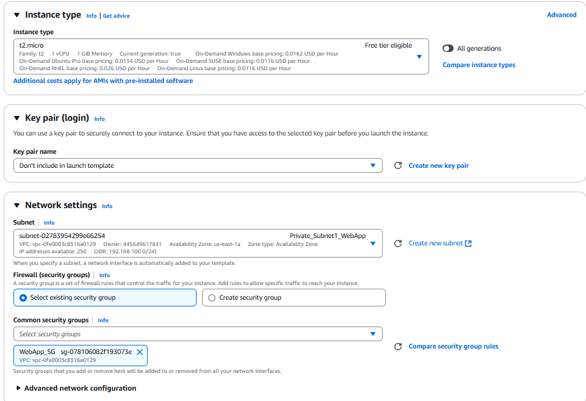
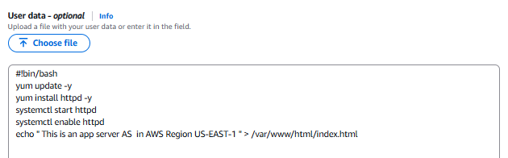
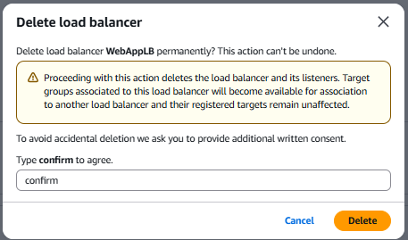

# AWS Web Application Deployment Labs

A step-by-step implementation of a highly available web application with VPC, NAT Gateways, ALB, and Auto Scaling.

---

## Lab 1: Creating the VPC and Subnets 🏗️

### **Create a Custom VPC**  
   - Name tag: "WebApp_VPC"
   - CIDR Block: `192.168.0.0/16`  

   - Enable **DNS hostnames** (VPC Settings > Actions).

### **Internet Gateway**
- Create and attach to the VPC.
- Name tag: "WebApp_VPC_IG"

### **Public Subnets**
| Subnet Name             |   AZ        | CIDR Block       |
|-------------------------|-------------|------------------|
| `Public_Subnet1_WebApp` | `us-east-1a`| `192.168.10.0/24`|
| `Public_Subnet2_WebApp` | `us-east-1b`| `192.168.20.0/24`|

### **Route Table**: 
- Name: `WebApp_Public_RT` with route `0.0.0.0/0` → Internet Gateway "WebApp_VPC_IG".

- Enable **Auto-assign public IPv4** for both subnets.

### **Private Subnets**
| Subnet Name               |   AZ        | CIDR Block        |
|---------------------------|-------------|-------------------|
| `Private_Subnet1_WebApp`  | `us-east-1a`| `192.168.100.0/24`|
| `Private_Subnet2_WebApp`  | `us-east-1b`| `192.168.200.0/24`|

## Lab 2: Creating Two NAT Gateways 🌐

### **NAT Gateways**
- **NAT Gateway A**: Deploy in `Public_Subnet1_WebApp` (us-east-1a) with Elastic IP.

- **NAT Gateway B**: Deploy in `Public_Subnet2_WebApp` (us-east-1b) with Elastic IP.

### **Private Route Tables**
| Route Table      | Target           |
|------------------|------------------|
| `WebApp_Private_RT1`   | NAT Gateway A    |
| `WebApp_Private_RT2`   | NAT Gateway B    |

---

## Lab 3: IAM Role and EC2 Instances 🔑

### **IAM Role for SSM**
- **Role Name**: `WebApp_TO_SSM`
- Attach **AmazonSSMManagedInstanceCore** policy.

### **EC2 Deployment**

- **Security Group**: `WebApp_SG` (Inbound: HTTP/80 | Outbound: All).

- **Instances**:
  - `WebApp_Server1` in `Private_Subnet1`
  - `WebApp_Server2` in `Private_Subnet2`
- **Specs**: `t2.micro`, Amazon Linux 2023 AMI.

- **IAM Role**: Attach `WebApp_TO_SSM`.

- **User Data Script**

  - [Script-WebApp_Server1](files/Script-WebApp_Server1.sh)

  - [Script-WebApp_Server2](files/Script-WebApp_Server2.sh)

### **Validation**  
   - Connect via **SSM Session Manager**:  
 
    
 
    sudo systemctl status httpd

curl http://"instanceprivateip"

## Lab 4: Application Load Balancer (ALB) ⚖️

### **Target Group**  
   - Name: **WebApp-TG** (Port 80, HTTP)  
   - Register both EC2 instances.  

### **Security Group**  
   - **ALBSG**: Allow inbound HTTP/80 from anywhere.  

### **Create ALB**  
   - Name: **WebALB** (Internet-facing)  
   - Attach to **Public_Subnet1** and **Public_Subnet2**.  
   - Test ALB DNS name in a browser after instances are healthy.  

## Lab 5: Auto Scaling and Security Hardening 🔒

### **Auto Scaling Group**

#### **Launch Template**  
- Name `WebApp_Template`
- Use `t2.micro`, AMI: **Amazon Linux 2023**, Security Group: **WebApp_SG**.  

- user data [Script-LaunchTemplate](files/Script-LaunchTemplate.sh)   

#### **Auto Scaling Group**  
- Name: **WebApp_ASG**  

- Subnets: `Private_Subnet1` and `Private_Subnet2`  

   - Desired: 4 | Min: 2 | Max: 6  
   - Attach to **WebApp-TG** and enable ALB health checks.  

#### **Validation**  
- Terminate original instances; confirm ASG replaces them.  

- Test ALB DNS again.  

### **Security Group Lockdown** 

#### **Update WebApp_SG**  
   - Allow inbound HTTP/80 **only from ALBSG**.  

#### **Update ALBSG**  
   - Allow outbound HTTP/80 to **WebApp_SG**.  

## Lab 6: Cleanup 🧹

**Delete resources in this order:**  
1. Terminate EC2 instances.  

2. Delete Auto Scaling Group and Launch Template.  

3. Delete ALB, Target Group (**WebTG**), and **ALBSG**. 

4. Delete NAT Gateways and release Elastic IPs.  

5. Delete subnets, route tables, Internet Gateway, and VPC.  

⚠️ **Important**: Clean up all resources to avoid unexpected charges. 
